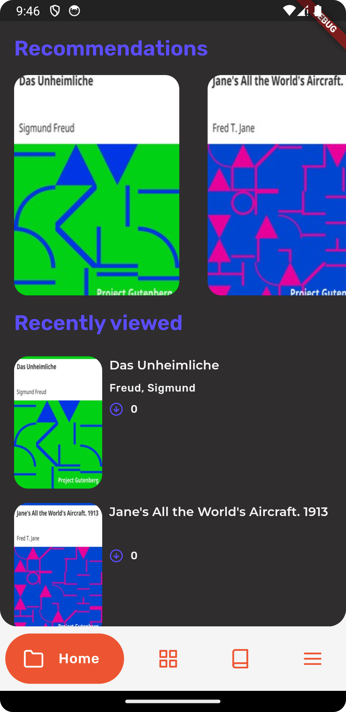
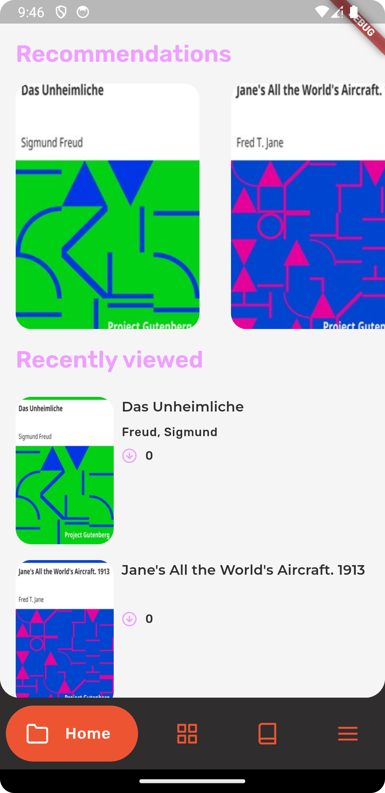
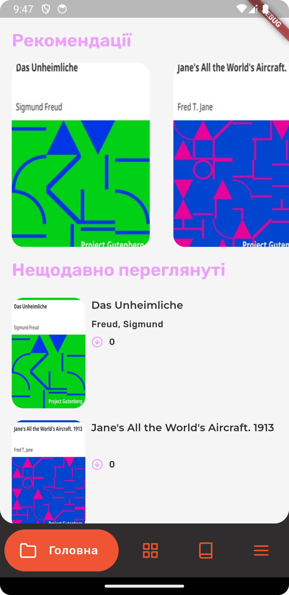
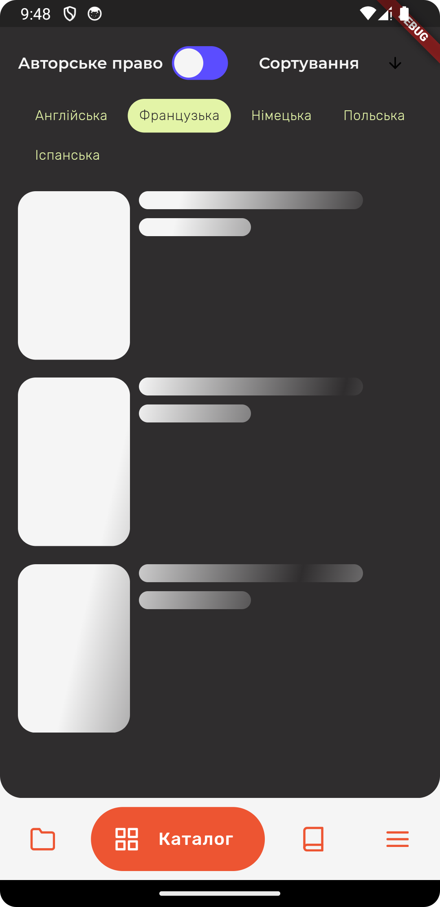
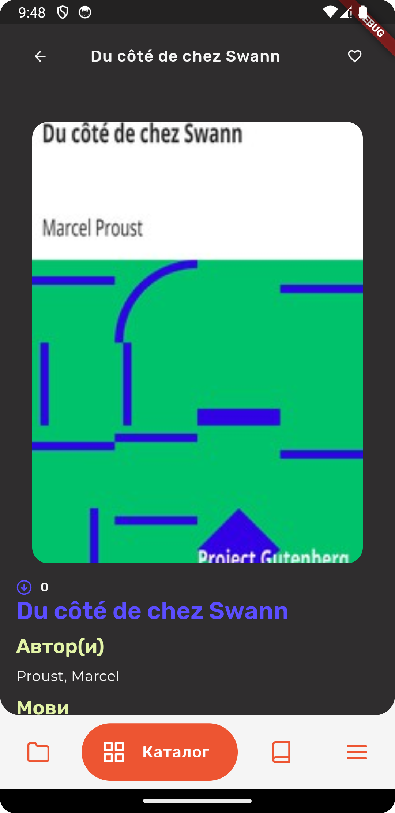
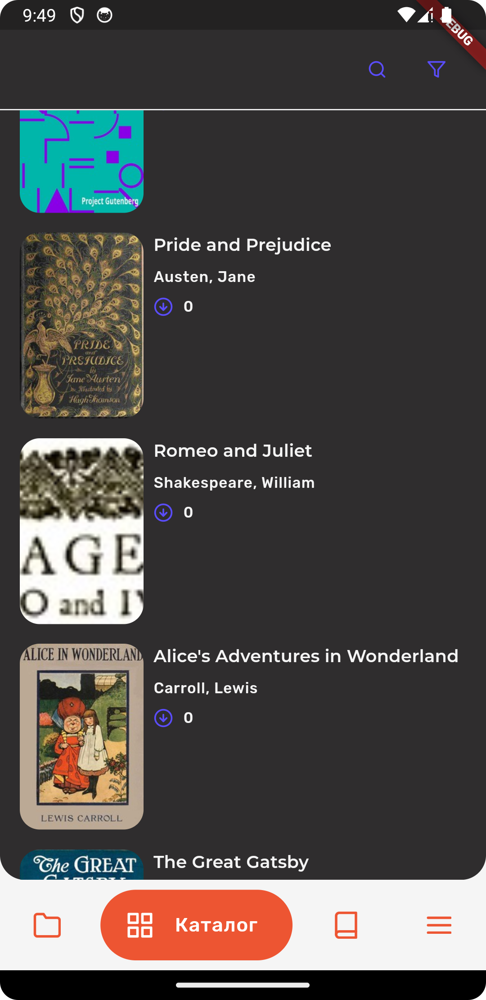

# yet-another-flutter-showcase-app

## Overview

__YAFSA__ - Yet Another Flutter Showcase App - simple PoC app for learning Flutter.

This project is an educational Flutter application.
Its main goal is to comprehensively apply the knowledge gained while learning Flutter.
The app serves as a client for the [Gutendex API](https://gutendex.com/), which provides access to a
collection of books from Project Gutenberg.

## Tech stack

External libraries used in this project:

- [Bloc](https://pub.dev/packages/flutter_bloc);
- [go_router](https://pub.dev/packages/go_router);
- [dio](https://pub.dev/packages/dio);
- [Hive](https://pub.dev/packages/hive);
- [SharedPreferences](https://pub.dev/packages/shared_preferences);
- [Get_It](https://pub.dev/packages/get_it);

Architecture:

- [Clean Architecture](https://en.wikipedia.org/wiki/Clean_architecture);
- [Bloc](https://pub.dev/packages/flutter_bloc) for state management;
- DI;
- Domain layer & usecases;

## Features

Following features are implemented in the app:

- Onboarding;
- Main screen:
  - home page with recently viewed books & recommended books;
  - catalog page with a list of books, filter & search;
  - library page;
  - menu:
    - theme chooser;
    - language chooser;
    - about;
- Book details page.

|     |     |    |
|--------------------------------|--------------------------------|-------------------------------|
|     |     |    |


## License

MIT License

```  
Copyright (c) [2024] [Andrew Malitchuk]  
  
Permission is hereby granted, free of charge, to any person obtaining a copy  
of this software and associated documentation files (the "Software"), to deal  
in the Software without restriction, including without limitation the rights  
to use, copy, modify, merge, publish, distribute, sublicense, and/or sell  
copies of the Software, and to permit persons to whom the Software is  
furnished to do so, subject to the following conditions:  
  
The above copyright notice and this permission notice shall be included in all  
copies or substantial portions of the Software.  
  
THE SOFTWARE IS PROVIDED "AS IS", WITHOUT WARRANTY OF ANY KIND, EXPRESS OR  
IMPLIED, INCLUDING BUT NOT LIMITED TO THE WARRANTIES OF MERCHANTABILITY,  
FITNESS FOR A PARTICULAR PURPOSE AND NONINFRINGEMENT. IN NO EVENT SHALL THE  
AUTHORS OR COPYRIGHT HOLDERS BE LIABLE FOR ANY CLAIM, DAMAGES OR OTHER  
LIABILITY, WHETHER IN AN ACTION OF CONTRACT, TORT OR OTHERWISE, ARISING FROM,  
OUT OF OR IN CONNECTION WITH THE SOFTWARE OR THE USE OR OTHER DEALINGS IN THE  
SOFTWARE.  
```
